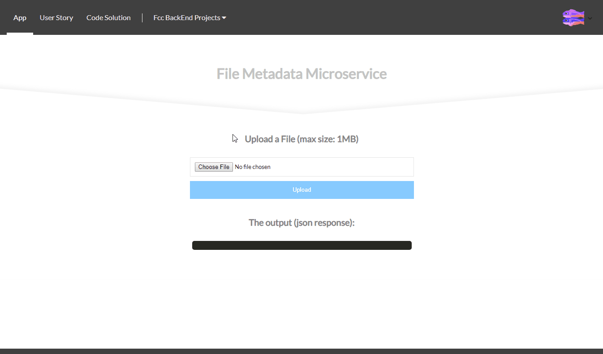

# API Project: File Metadata Microservice for freeCodeCamp
### About the project

it's a freecodecamp project in the "Apis and Microservices Projects" module, you have to build an API that will receive a File and return a json response containing a informations about that file.

bonus*: 
- Front-end using React, Sass, Responsive Design

### Tools used

**Front-end:** React

**Back-end:** Express

### Screenshot

### Link

https://fcc-bt-file-metadata.glitch.me

### User stories

1. I can submit a form that includes a file upload.
2. The form file input field has the "name" attribute set to "upfile". We rely on this in testing.
3. When I submit something, I will receive the file name and size in bytes within the JSON response
